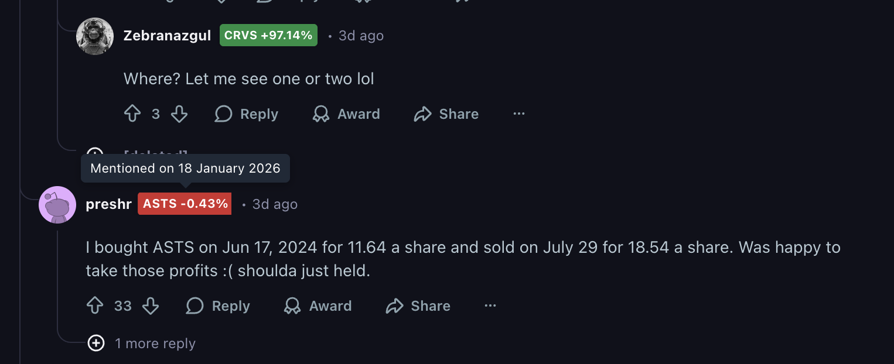

# Sopeko Extension

Chrome extension that displays stock ticker badges next to Reddit usernames, showing which stocks they've mentioned and the price change since their mention.

**Backend:** [sopeko_backend](https://github.com/stuneak/sopeko_backend)

## Setup

1. Open Chrome and go to `chrome://extensions/`
2. Enable **Developer mode** (top right toggle)
3. Click **Load unpacked**
4. Select this `sopeko_extension` folder

## Configuration

- `API_BASE_URL` in `background.js` - backend API endpoint
- `EXCLUDED_USERNAMES` in `content.js` - usernames to skip (mods, bots)

## Usage

Browse Reddit - badges will automatically appear next to usernames showing their mentioned tickers with percent change (green = gain, red = loss).
